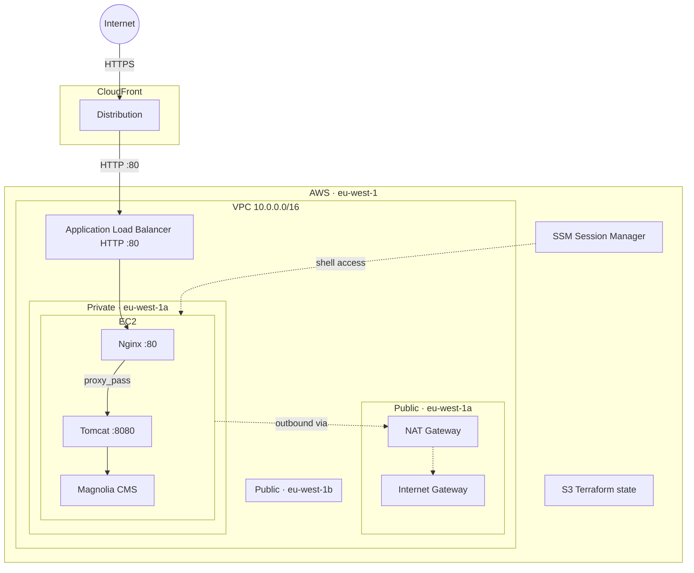

# Crescendo DevOps Exam

## Overview

Deploys [Magnolia CMS Community Edition](https://www.magnolia-cms.com/) on AWS as a demo environment, reachable end-to-end via a CloudFront URL.

**Stack:** AWS (VPC · EC2 · ALB · CloudFront) · Terraform · GitHub Actions · Nginx · Apache Tomcat · Magnolia CMS 6.2

This is a demo-grade setup — it prioritises clarity and reproducibility over production hardening.

---

## Architecture



---

## Design decisions
General
- Stick to the test scope, avoid complexity

Infrastructure
- Use latest stable terraform 1.15 
- Store tfstate in AWS S3 with native locking
- Deploy in AWS Ireland region for compatibility
- Expose the app only via CDN
- Access to the EC2 only via SSM 
- EC2 sized for a demo, in the free tier

Application
- EC2 AMI using Amazon Linux 2023 to simplify deployments and have native support (SSM)
- Use the demo files for easy out-of-the-box setup
- Define a systemd entry to run magnolia as a system service
- Treat the EC2 node as disposable, to reduce complexity
- Shell access only via SSM or web console, for security

CI
- Establish trust between GH and AWS IAM via OIDC for simplicity and security
- Simple terraform workflows, one for the test, two for my own testing
- Protect tf apply requiring my approval

---

## How to run

### Prerequisites

- [Terraform](https://developer.hashicorp.com/terraform/install) `~> 1.15`
- [AWS CLI](https://docs.aws.amazon.com/cli/latest/userguide/install-cliv2.html) configured with credentials sufficient to run the bootstrap steps
- Write access to this GitHub repository

### 1. One-time bootstrap

Follow [`tf-bootstrap/tf-bootstrap.md`](tf-bootstrap/tf-bootstrap.md). This creates:

- S3 bucket for Terraform state (`rfirpo-crescendo-tfstate`)
- OIDC identity provider in IAM
- IAM role trusted by this repository (`rfirpo-crescendo-github-actions`)
- Repository secret `AWS_ROLE_ARN`

### 2. Create the GitHub deployment environment

In the repository: **Settings → Environments → New environment**

- Name: `production`
- Enable **Required reviewers** and add yourself

This is the approval gate between the Plan and Apply jobs.

### 3. Deploy via GitHub Actions (recommended)

1. Go to **Actions → Terraform Apply → Run workflow**
2. The **Plan** job runs automatically — output is posted to the job summary
3. Once Plan succeeds, a **Review deployments** prompt appears — inspect the plan and approve
4. The **Apply** job runs against the saved plan file

> Magnolia takes **3–5 minutes to fully initialise** after the instance is running. The ALB target will show `unhealthy` during startup and self-heal. Total time from `apply` to a working CloudFront URL: **~10–12 minutes**.

The CloudFront URL is printed at the end of the Apply job as a Terraform output.

### 4. Local deployment (alternative)

```bash
cd terraform
terraform init
terraform plan
terraform apply
```

Requires AWS credentials locally (e.g. `aws sso login` or an access key with the same permissions as the CI role).

### Teardown

Run **Actions → Terraform Destroy → Run workflow**, review the destroy plan, and approve.

---

## Troubleshooting

### Bootstrap verification

```bash
# State bucket exists and versioning is enabled
aws s3api get-bucket-versioning \
  --bucket rfirpo-crescendo-tfstate \
  --region eu-west-1

# IAM role exists
aws iam get-role \
  --role-name rfirpo-crescendo-github-actions \
  --query "Role.Arn" --output text
```

### ALB target health

```bash
TG_ARN=$(aws elbv2 describe-target-groups \
  --query "TargetGroups[?contains(TargetGroupName,'rfirpo-crescendo')].TargetGroupArn" \
  --output text --region eu-west-1)

aws elbv2 describe-target-health \
  --target-group-arn "$TG_ARN" \
  --region eu-west-1
```

Expected: `"State": "healthy"`. If `initial`, Magnolia is still starting — wait and retry.

### EC2 and application (via SSM)

```bash
# Get the instance ID
INSTANCE_ID=$(aws ec2 describe-instances \
  --filters \
    "Name=tag:Name,Values=rfirpo-crescendo-magnolia" \
    "Name=instance-state-name,Values=running" \
  --query "Reservations[0].Instances[0].InstanceId" \
  --output text --region eu-west-1)

# Open a shell (no SSH key needed)
aws ssm start-session --target "$INSTANCE_ID" --region eu-west-1
```

Once connected:

```bash
# Bootstrap script output (check for errors during user_data)
sudo cat /var/log/user-data.log

# Magnolia service status
systemctl status magnolia

# Live Magnolia log — startup takes 3–5 min on first boot
sudo journalctl -u magnolia -f

# Nginx status
systemctl status nginx

# Verify Nginx → Tomcat locally (bypasses ALB and CloudFront)
curl -s -o /dev/null -w "%{http_code}\n" http://localhost/
# Expected: 200
```

### End-to-end

```bash
cd terraform && terraform output cloudfront_url
```

Open the URL in a browser. Expected: Magnolia login page.  
Default credentials: `superuser` / `superuser`

The first page load after a cold start may be slow (Tomcat JSP compilation).

---

## Assumptions
- This setup is just for showing up basic skills in a demo, not intended for production purposes
- Having the application loading is enough

## Known limitations
- Just basic security implemented, we are essentially exposing a dev instance
- Not properly dimensioned for any other use than showing the app running
- Not setup for HA or scalability
- No permanent storge in disk or db
- No centralized user storage
- No secret storage used (only the superuser passwd used)
- New instance deployment and startup times are quite slow
- No distinct author / publisher instance roles
- Lack of protection against attackers (DDoS, ...)
- May not be ready to deploy elsewhere without changing hardcoded strings (e.g. github user, project name)
- CI is limited to plan for other users
- GHA workflows and SDLC are simplistic and offer little protection
- EC2 instance is recreated after each change, this is a major PITA but I consider it out of scope
- EC2 instance is recreated from scratch every time, no AMI or similar created. 

## Disclaimer
This code has been written with assistance from Anthropic's GenAI models. 